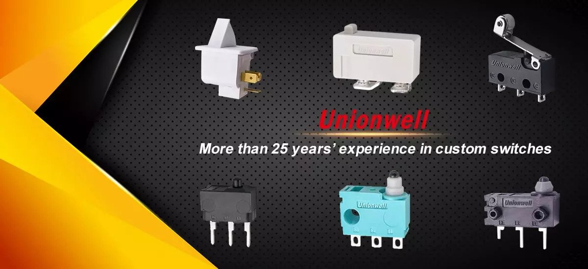

# unionwells

**_Unionwell is a professional China Micro Switch and mechanical switches Manufacturer._**

[China Micro Switch Manufacturer](https://www.unionwells.com/), Unionwell, is famous for offering high-quality micro switches. A microswitch is a thing that reacts to environmental changes by opening or closing a set of moving contacts to restrain an appliance. If the micro switch senses movement out of its environment, a plunger is pushed or released to start or close a circle. The plunger actuator requires a particular quantity of force upon it to alter the touching way. Each micro-switch holds a plunger actuator to switch the connection style, but a lot of them contain an extra actuator like a float or sail, to feel the surroundings change, such as fluid level or airflow. Unionwell produces many types of micro switches that come in different shapes and sizes and are being used in different domains such as electronic devices, instrumentation, mining, power systems, household devices, electrical equipment, and aerospace, aviation, ships, weapons, tanks and other army areas.

Mechanical switches are physical switches that offer visual feedback when tapping on the actuation position. [China micro switch company](https://www.unionwells.com/aboutus.html), Unionwell produces 3 types of buttons, based on their properties: tactile switches, linear switches, and clicky switches. Linear switches are mostly practiced in mechanical consoles. These switches have different responses, sound, and travel times, making them appealing to professionals and heavy typists. Clicky buttons give attached click audio, when tapping on the actuation spot. Both tactile and clicky switches do not need to push the key down the way down to get feedback. Users can issue the permit immediately after getting the feedback. When touching a key, users can get instant tactile feedback. In many cases, they can also get an audio response in the form of the well-known clicky noise.

Unionwell outcomes are known for their high quality, versatility, and durability. Their micro switches can be observed in common household objects such as dishwashers, hot water faucets, electric ovens, ice makers, and more. Their slide switches are generally used in many forms, including appliances, small equipment, consumer electronics, computer servers, lighting devices, instrumentation, test and analysis devices.

## About Unionwell

Unionwell is a top-level micro switch company in China. Headquartered in Huizhou, the organization is especially strong in realizing high-efficiency micro switch series, rotary switch series, push-button power switch series, waterproof switch series, and other switch types alike. Their quality switches are thoroughly tested and complied with UL, ENEC, EK, CQC lab certifications. The company's workshop covers than 22,000 square meters and controls an output of more than 300 million items per year.

**Email: info@unionwells.com**

**Organization:** **Huizhou Unionwell Technology Co., Ltd**

Address: No. 532, Office Building, Huizhou Industrial Transfer Industrial Park, Longmen County, Huizhou City, Guangdong Province,China

Phone:+86- 18169936698

Original Article [here](https://nationaljobs.washingtonpost.com/employer-details/1278/unionwell/)
